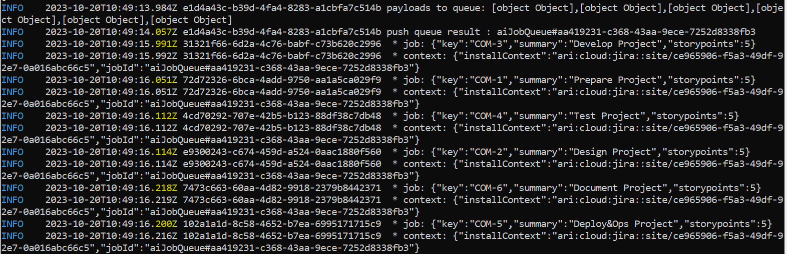
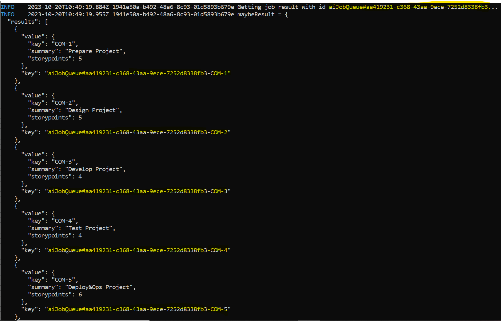

# Forge AI Backlog Issues Helper

# Table of contents
1. [Introduction](#introduction)

2. [Forge CLI App Development Challenges](#forge-cli-app-dev-challenges)
    1. [Laptop Operating System and Libraries Installation](#laptop-os-lib-install)
    2. [Session Login](#session-login)

3. [Application Coding Challenges](#app-coding-challenges)
    1. [Full Stack (Frontend and Backend) Typescript App](#fullstack-typescript-app)
    2. [Backlog Issues Processing as Forge Asynchronous Events](#backlog-issues-processing-forge-asynchronous-events)

4. [List of Forge CLI Used Commands for ComboGeist94 Forge application Development](#list-forge-cli-commands-forge-app-dev)

5. [List of Modules (Atlaskit and Forge) used for the Frontend Development](#list-modules-frontend-dev)

6. [List of Forge Dependencies used for the Backend Development](#list-forge-dependencies-backend-dev)

7. [Conclusion and Takeaways](#conclusion-takeaways)

8. [Resources](#resources)

# 1. Introduction <a name="introduction"></a>

BacklogIssueHelper project, proposed for Codegeist Unleashed 2023 Challenge, helps Atlassian users to enhance, analyze Backlog issues and provides some translations.

The solution includes a Frontend component with @Atlaskit modules and also a Backend component interacting with OpenAI to manage story points estimation suggestion and issue translation prompts.

Since the enhancement processing for each Backlog issue can be time consuming, particularly when calling external OpenAI API (see screenshot below) are involved,  It has been necessary to use the  asynchronous event feature permitted by Forge Event/Storage Modules.


This document focuses on experience of Forge App Development about Backlog Issue Helper Project and outlines how various encountered issues/challenges.have been solved.

At the end, there are some resources links to get more details about Forge App development  and Documentation and my Combogeist94 (application name) Forge App public link


# 2. Forge CLI App Development Challenges <a name="forge-cli-app-dev-challenges"></a>

## 2.1. Laptop Operating System and Libraries Installation <a name="laptop-os-lib-install"></a>

Forge App development requires docker and installation of forge cli framework, deployed in particular with npm install command, but some dependency conflict failures have been fixed by using the following special argument : legacy peer deps

The development laptop is based on Windows OS, configured with WSL (Windows Subsystem for Linux) + Debian Linux docker (not Docker Desktop on Windows). At the end, The Forge Application could be developed without any problems with these environment conditions.

## 2.2. Session Login <a name="session-login"></a>

Forge CLI  commands require authentication with long Api Token value to be able to interact with Atlassian Jira Cloud.

Since it was impossible to open the Forge session by using copy paste the APi token interactively on the opened session console, the problem has been fixed by using Environment variables to save the Forge Email account and encrypted Forge Api token value as illustrated in following screenshot


# 3. Application Coding Challenges <a name="app-coding-challenges"></a>

## 3.1. Full Stack (Frontend and Backend) Typescript App <a name="fullstack-typescript-app"></a>

**Typescript** enables to guarantee more readable code, type checking inside Typescript **ts** files.

The frontend has been developed also with Typescript by using **tsx** files, but compilation errors have appeared and have been fixed by defining a specific declaration  in its tsconfig file.

## 3.2. Backlog Issues Processing as Forge Asynchronous Events <a name="backlog-issues-processing-forge-asynchronous-events"></a>

Initial planning was to use a single Forge Job Queue which manages (push, get) all backlog issues data with only one single jobId as key, but that approach has been abandoned since each backlog issue needs to be handled independently and asynchronously.

On receiving one single List of Items push request, Forge Storage Module produces separate event for each backlog issue at various different milliseconds (see following screenshot)



On consuming each Backlog issue event, each resulting generativeAI operation has been stored with key combing jobQueueId and IssueKey, in order to extract these results easily with appropriate selection filters.
Example : aiJobQueue#aa419231-c368-43aa-9ece-7252d8338fb3-COM-1 
where aiJobQueue#aa419231-c368-43aa-9ece-7252d8338fb3 is the jobQueueId and COM-1 is the issueKey

Periodically, the Frontend UI calls the Backend to retrieve the enhanced backlog issues. This is made possible by calling the query method of **@forge/Storage** component with following filtering criteria :

```
await storage.query().where('key', startsWith(jobId)).getMany()

```




# 4. List of Forge CLI Used Commands for ComboGeist94 Forge application Development <a name="list-forge-cli-commands-forge-app-dev"></a>


**forge create** : enable to initiate a Forge App by adding appropriate directories/files  and automate the interaction with remote environments.

**forge login** : option to open session  for the CLI client to interact with remote environment

**forge deploy** [ -e   environment ] : enables to deploy the application on remote platform at appropriate environment (development, staging, production)

**forge logs**  : displays Application logs on windows  console

**forge variables** set | list [ –e environment ] : enables to set/list application environment variables used during running

**forge settings** : manages settings such as default-environment

**forge tunnel** : enables to test the application using local codeset

**forge install**  [ -e environment ] : enables to install application on various environments : development (default), staging, production


# 5. List of Modules (Atlaskit and Forge) used for the Frontend Development <a name="list-modules-frontend-dev"></a>

**@atlaskit/button** > Button element

**@atlaskit/css-select** > stylesheet

**@atlaskit/icon/glyph/chevron-down** > ChevronDownIcon element for the Popup

**@atlaskit/form** > Label element

**@atlaskit/select** > PopupSelect element

**@atlaskit/spinner** > Spinner element

**@atlaskit/textfield** > Textfield element

**@forge/bridge** > invoke method to exchange with the backend endpoints


# 6. List of Forge Dependencies used for the Backend Development <a name="list-forge-dependencies-backend-dev"></a>

**@forge/resolver** > Resolver class/endpoint service management

**@forge/events** > Queue to manage events, Payload class item to exchange data

**@forge/api** > storage for data crud (set, get, delete) management, api, route to interact with external service


# 7. Conclusion and Takeaways <a name="conclusion-takeaways"></a>

This document has presented Forge App Development Experience covering:

Windows OS Laptop development if not using Docker Desktop (for license reason)

=> Takeaway 1 : Forge App can be developed with **Forge Cli** +  Docker on **WSL** (Windows for Linux Subsystem) Linux such as ****Debian

Forge Cli Libraries Installation with **npm**

=> Takeaway 2 : Avoid dependencies conflict with command

```
npm install –legacy-peer_deps
```

Forge  App Coding

=> Takeaway 3 : Full stack (Frontend and Backend) Forge App coding with **Typescript** enabling better readability, type checking,...  is possible by allowing typescript extensions

=> Takeaway 4 : **@atlaskit** UI library and **@forge** dependencies provide interesting features which can be integrated respectively on frontend and backend side.


# 8. Resources <a name="resources"></a>


[Forge App Development Getting Started](https://developer.atlassian.com/platform/forge/getting-started/)


[Atlassian Atlaskit Components Documentation](https://atlassian.design/components)


[Public shared Combogeist94 Forge App to be activated on Atlassian JIRA cloud](https://developer.atlassian.com/console/install/3635ce82-57dc-4534-a216-956d24187125?signature=782055d03546ddd69838fd3330ff3dca67cfbe8e33efe9e31d66e11fc42afccf936cc38a368dc24eca61e697fff0d8c9c5bf695932592947fe11bfc0a4a4b8a0&product=jira)


BacklogIssuesEnhancementHelper Architecture >


Combogeist94 Application production >


Combogeist Backlog Issues Helper Run on Atlassian JIRA Cloud >


