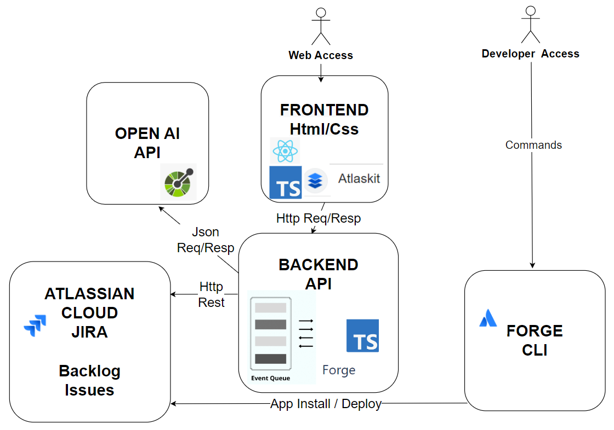
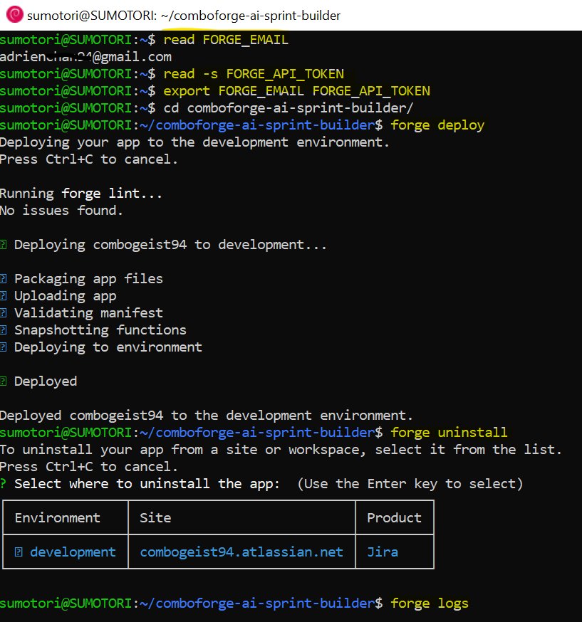
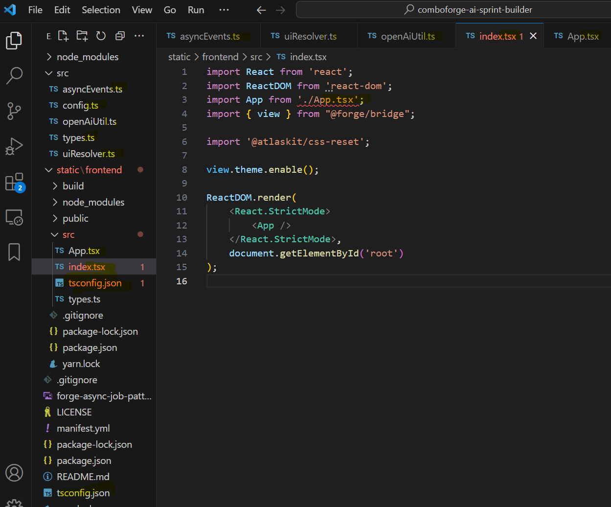
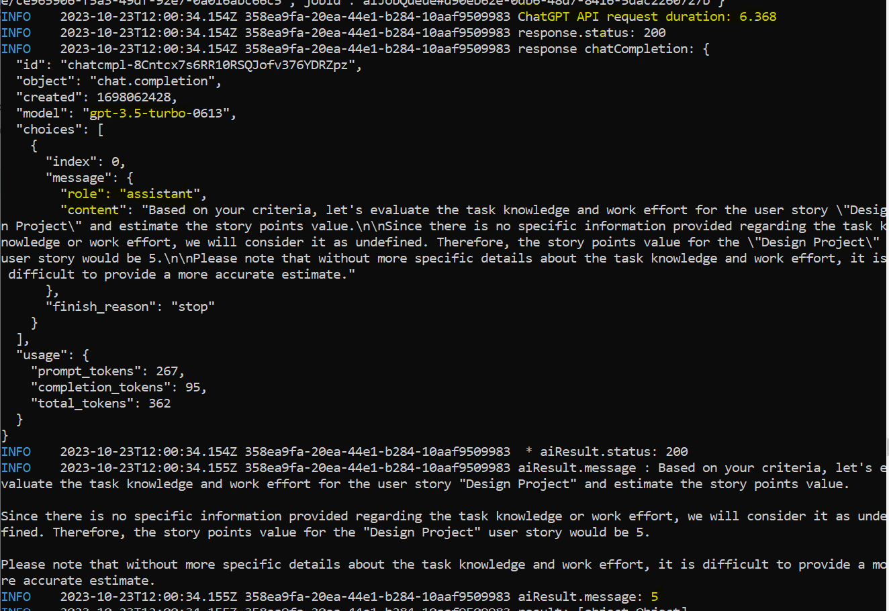
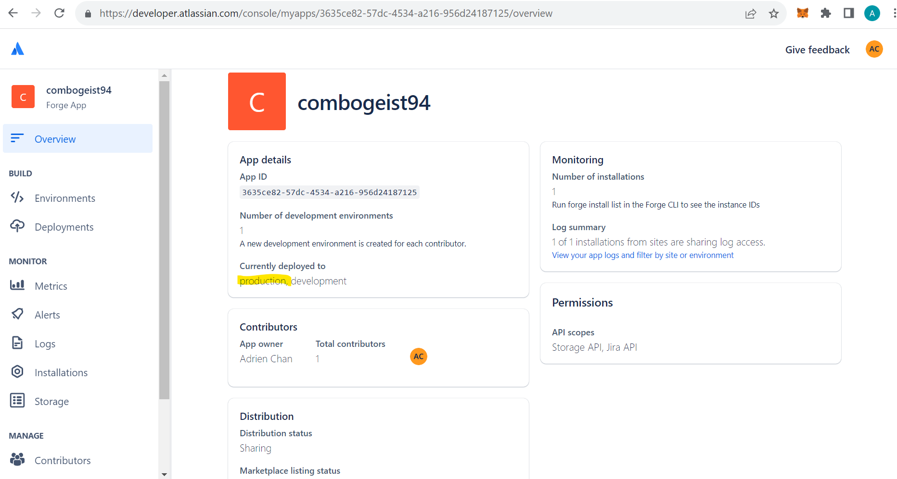
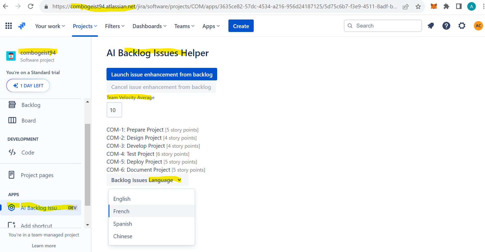

# Forge AI Backlog Issues Helper

This app demonstrates a Forge apps for **Codegeist Challenge AI**. It also delegates AI processing to an asynchronous task such that it may be able to benefit from a longer runtime timeout and therefore be more resilient to expensive AI API requests.

If this is all a bit new to you, you may also like these other example apps and tutorials:
* [Getting started: creating a hello world app in Forge](https://developer.atlassian.com/platform/forge/getting-started/)
* [The basics of building a Forge AI app](https://blog.developer.atlassian.com/forge-ai-basics/)

## App overview

The app provides functionalities to help analyze, suggest storypoints, translate the project's backlog issues.

The app uses the `jira:projectPage` extension point to render a user interface (UI) that allows the user to analyze and enhance Backlog issues. The title of the project page is "AI Backlog Issues Helper". The app uses AI to evaluate the issues and suggests storypoint, based on Team Velocity Average calculated using OpenAI special Prompts. All current project Backlog Issues are returned with suggested storypoints

The Backlog issues with suggested storypoints are returned to the UI which then presents them to the end user. The UI also has a text field allowing ther user to change the Team Velocity Average. The UI enables user to choose the language for Issues summary/description.

## Implementation overview

The Full Stack (frontend and backend) Application has all been coded in Typescript .ts / .tsx , using @Atlaskit (button, css-reset, form, select, spinner, textfield,..)  dependencies + @forge/bridge on frontend and several @forge modules (events, resolver, storage) at backend side.

The UI is implemented with [Custom UI](https://developer.atlassian.com/platform/forge/custom-ui/iframe/). The UI sends a `LaunchEnhancement` [invoke](https://developer.atlassian.com/platform/forge/custom-ui-bridge/invoke/#invoke) request to the backend to initiate the AI operation. This operation generates an ID to represent the job and delegates the job to another function using the [async event API](https://developer.atlassian.com/platform/forge/runtime-reference/async-events-api/#async-events-api). At this point, the job ID is returned to the UI and the function invocation ends. 

The asynchronous function invocation is where the AI call occurs. The result of the call is stored in [Forge Storage](https://developer.atlassian.com/platform/forge/runtime-reference/storage-api/#storage-api) in a record with a key based on the job ID and Backlog Issue Key.

Whilst the back end is waiting for the AI API to return a result, the app's front end periodically polls it's backend until the result is available. This is done by sending a `pollJobResult` [invoke](https://developer.atlassian.com/platform/forge/custom-ui-bridge/invoke/#invoke) request. The implementation of this request simply involves attempting to retrieve the results from [Forge Storage](https://developer.atlassian.com/platform/forge/runtime-reference/storage-api/#storage-api) with query to match all items (Issues) whose key starts with jobId. The UI passes the job ID so the back end knows the key of the storage records to match with. 

## Setup

Run `forge variables set --encrypt OPEN_API_KEY {your-open-ai-key}` and deploy with `yarn deploy` before

## Prompt design

This section defines the prompt used to request the issue storypoints suggestion. The prompt and the AI process may need to be optimised.

## Screenshots

Architecture >

Forge cli commands >

Combogeist Application Codebase >

Combogeist OpenAI Story Points Estimation >

Combogeist Application production >

Combogeist Backlog Issues Helper Run on Atlassian JIRA Cloud >

